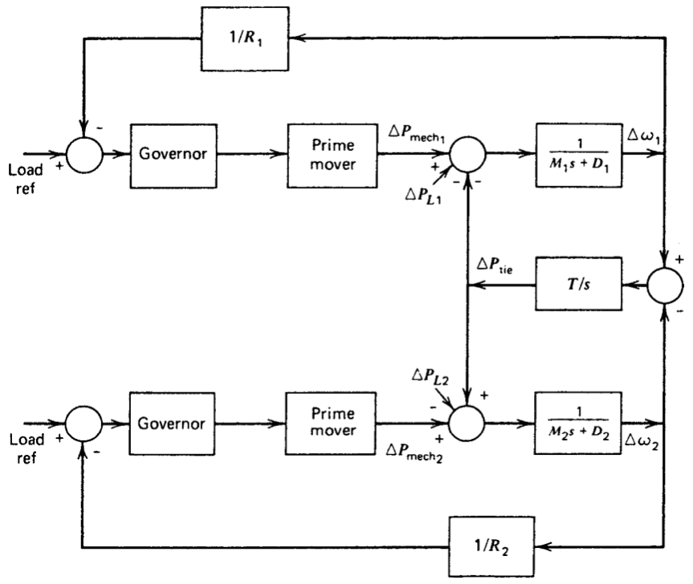

# edxu96/FreqControl: Feedback Control of Power System Frequency in MATLAB

## 1. Rotating Frequency

_Figure 1. Mechanical and electrical torques in a generating unit. [_wood2014power_]_

## 2. Automatic Generation Control (AGC)

> Automatic generation control (AGC) is the name given to a control system having three major objectives: [_wood2014power_]
> 1. To hold system frequency at or very close to a specified nominal value (e.g., 50 or 60 Hz).
> 2. To maintain the correct value of interchange power between control areas. 3. To maintain each unit’s generation at the most economic value.

_Figure 2. Tie-line bias supplementary control for two areas. [_wood2014power_]_

---

[_wood2014power_]: https://github.com/edxu96/symposium/tree/master/src
