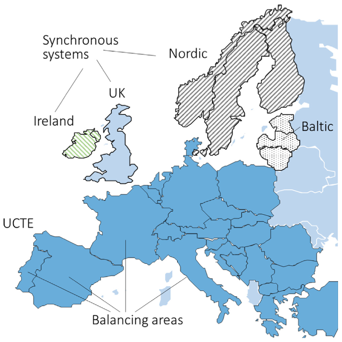
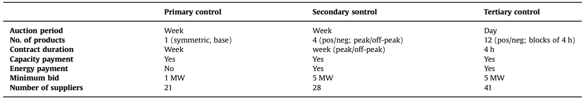

# Introduction

- [@hirth2015balancing] Hirth, L., & Ziegenhagen, I. (2015). Balancing power and variable renewables: Three links. Renewable and Sustainable Energy Reviews, 50, 1035-1051.

```{r, out.width='75%', echo=F, fig.align='center', fig.cap='Each synchronous system consists of one or several balancing areas. Balancing power is used to balance both the synchronous area (frequency at 50 Hz) and the balancing area (area control error at zero). UCTE (or “Regional Group Continental Europe”) is the largest European synchronous system that covers all of Europe except Ireland, the UK, the Baltic and Nordic region, Albania, the countries east of Poland/Romania, and most islands. It is composed of about 25 balancing areas. Germany is divided into four balancing areas, which in practice are operated as one. [@hirth2015balancing]'}

```

```{r, out.width='99%', echo=F, fig.align='center', fig.cap='Balancing power market design in Germany. [@hirth2015balancing]'}

```

Note that tertiary control is traded daily.

# Markets

- [@arroyo2005energy] Arroyo, J. M., & Galiana, F. D. (2005). Energy and reserve pricing in security and network-constrained electricity markets. IEEE transactions on power systems, 20(2), 634-643.
- [@vandezande2008implementation] Vandezande, L., Meeus, L., Saguan, M., Glachant, J. M., & Belmans, R. (2008, November). Implementation of cross-border balancing in Europe. In 2008 First International Conference on Infrastructure Systems and Services: Building Networks for a Brighter Future (INFRA) (pp. 1-6). IEEE.
- [@vandezande2009well] Vandezande, L., Meeus, L., Belmans, R., Saguan, M., & Glachant, J. M. (2010). Well-functioning balancing markets: A prerequisite for wind power integration. Energy policy, 38(7), 3146-3154.

# Quantification

- [@holttinen2012methodologies] Holttinen, H., Milligan, M., Ela, E., Menemenlis, N., Dobschinski, J., Rawn, B., ... & Detlefsen, N. K. (2012). Methodologies to determine operating reserves due to increased wind power. IEEE Transactions on Sustainable Energy, 3(4), 713-723.
- [@bucher2015quantification] Bucher, M. A., Delikaraoglou, S., Heussen, K., Pinson, P., & Andersson, G. (2015, June). On quantification of flexibility in power systems. In 2015 IEEE Eindhoven PowerTech (pp. 1-6). IEEE.
  * Operational Flexibility and locational flexibility are distinguished.
  * "TSOs need explicit information about available flexibility to maintain a desired reliability level at a reasonable cost"
- [@bucher2015quantification] Bucher, M. A., Delikaraoglou, S., Heussen, K., Pinson, P., & Andersson, G. (2015, June). On quantification of flexibility in power systems. In 2015 IEEE Eindhoven PowerTech (pp. 1-6). IEEE.

# Participation

When reserve markets are considered, the decision making framework becomes more complicated:

- [@just2008pricing] Just, S., & Weber, C. (2008). Pricing of reserves: Valuing system reserve capacity against spot prices in electricity markets. Energy Economics, 30(6), 3198-3221.
  * "This paper models the interdependencies between markets for secondary reserve capacity and spot electricity to derive the pricing of reserves under equilibrium conditions."
  * "The approach explores and formalizes the influence of reserve capacity on the spot market supply function."
- [@koliou2014demand] Koliou, E., Eid, C., Chaves-Ávila, J. P., & Hakvoort, R. A. (2014). Demand response in liberalized electricity markets: Analysis of aggregated load participation in the German balancing mechanism. Energy, 71, 245-254.

# Reserves for Grid Congestions Resulted from Regional Pricing

Regional pricing in day-ahead markets have caused two problems:

- grid congestion
- imbalance

